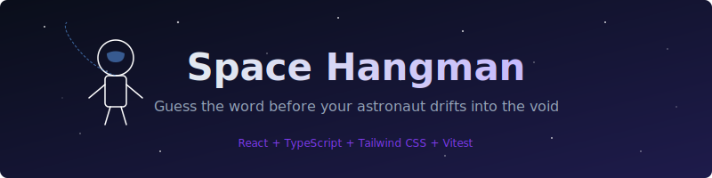

<p align="center">
  
</p>

# Space Hangman

A space-themed hangman game built with React, TypeScript, and Tailwind CSS.

Guess the word before your astronaut drifts into the void. You get 8 wrong guesses — each one reveals another part of the astronaut (helmet, suit, arms, legs, oxygen tank, and tether).

## Getting started

```bash
npm install
npm run dev
```

Then open http://localhost:5173 in your browser.

## Running tests

```bash
npm test
```

This runs 59 tests covering game logic, component behavior, and integration flows.

## Type-checking

```bash
npx tsc -b
```

## Project structure

```
src/
├── types/          # TypeScript interfaces (GameState, Stats)
├── logic/          # Pure functions — game rules, word list, stats
├── hooks/          # useGame (state management), useKeyboardListener
├── components/     # React components (Game, Keyboard, HangmanDrawing, etc.)
└── __tests__/      # Unit and component tests
```

## Tech stack

- **React 19** with TypeScript
- **Vite** for dev server and bundling
- **Tailwind CSS v4** for styling
- **Vitest** + React Testing Library for tests

## How it works

The game logic lives in `src/logic/` as pure functions with no side effects — easy to read, test, and extend. State is managed via `useReducer` in a custom `useGame` hook. The SVG astronaut drawing is built inline as a React component with conditional rendering based on wrong guess count.

Stats (wins, losses, streak) persist in localStorage across sessions.
